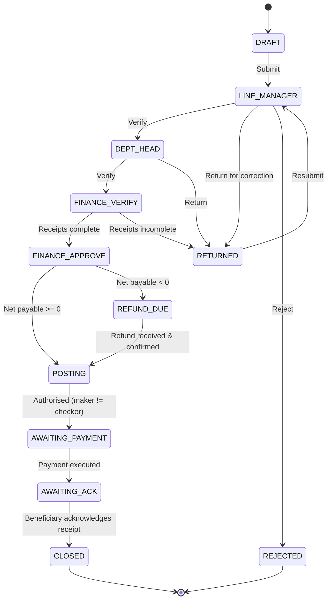
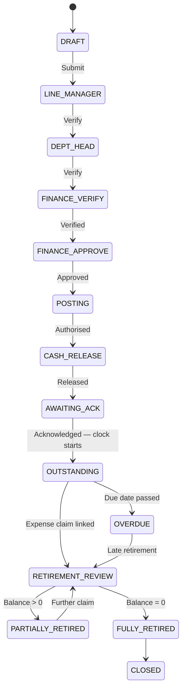
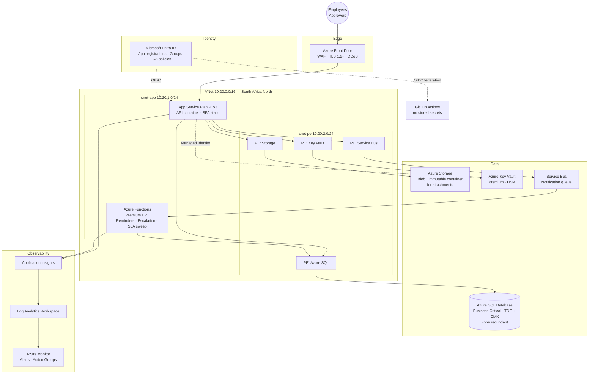

# 02 — Solution Architecture

---

## 1. Design principle: the engine knows nothing about expenses

The brief asks for a generic workflow engine so future processes can be added without redesign. That only holds if the engine has **zero** knowledge of expenses, advances or requisitions. The test is concrete: *adding a Leave Request module must require no C# change to the engine project and no schema migration.*

That drives a three-layer separation:

| Layer | Knows about | Changes when |
|---|---|---|
| **Workflow engine** (`Desicon.Workflow.Core`) | States, transitions, guards, actors, SLAs, escalation | Never, for a new module |
| **Module definition** (JSON + form schema, stored in DB) | The expense process specifically | A new module is added — as *data*, not code |
| **Module extension** (optional plug-in) | Rules the engine cannot express declaratively — e.g. "net payable may not exceed the advance without Finance Manager override" | Rarely |

Most modules need only layer 2. Expense needs a small layer-3 plug-in for the advance-netting arithmetic.

### Workflow definition shape

```jsonc
{
  "moduleKey": "EXPENSE",
  "formCode": "DEL-AC-FRM-002",
  "revision": "05",
  "numberFormat": "EXP-{yyyy}-{seq:000000}",
  "states": [
    { "key": "DRAFT",              "type": "initial" },
    { "key": "LINE_MANAGER",       "sla": { "hours": 24, "escalateTo": "DEPT_HEAD" } },
    { "key": "DEPT_HEAD",          "sla": { "hours": 24, "escalateTo": "FINANCE_VERIFY" } },
    { "key": "FINANCE_VERIFY",     "sla": { "hours": 48 } },
    { "key": "FINANCE_APPROVE",    "sla": { "hours": 48 } },
    { "key": "POSTING",            "sla": { "hours": 24 } },
    { "key": "AWAITING_PAYMENT",   "sla": { "hours": 72 } },
    { "key": "AWAITING_ACK",       "sla": { "hours": 48 } },
    { "key": "REFUND_DUE",         "sla": { "hours": 24 } },
    { "key": "CLOSED",             "type": "terminal" },
    { "key": "REJECTED",           "type": "terminal" },
    { "key": "RETURNED",           "type": "rework" }
  ],
  "transitions": [
    {
      "from": "FINANCE_APPROVE", "to": "REFUND_DUE", "action": "APPROVE",
      "actor": { "role": "FinanceManager" },
      "guard": "NetPayableNgn < 0"
    },
    {
      "from": "FINANCE_APPROVE", "to": "POSTING", "action": "APPROVE",
      "actor": { "role": "FinanceManager" },
      "guard": "NetPayableNgn >= 0"
    },
    {
      "from": "POSTING", "to": "AWAITING_PAYMENT", "action": "AUTHORISE",
      "actor": { "role": "FinanceManager" },
      "guard": "AuthoriserId != PosterId && GlDebits == GlCredits"
    }
  ]
}
```

Actors resolve dynamically — `{ "resolver": "LineManagerOf", "arg": "RequesterId" }` — so the engine never stores a person's name in a definition. Guards are a restricted expression language (comparison, boolean, field reference, and a whitelist of functions) evaluated server-side against the request's own fields. No arbitrary code execution, no `eval`.

A full working definition is provided at `workflows/expense-reimbursement.workflow.json`.

---

## 2. Expense workflow — including the branch the brief omits



Two things to note. `REFUND_DUE` is the negative-net-payable path from finding 1 in document 01 — without it, over-drawn advances quietly disappear. And `AWAITING_ACK` sits between payment and closure, which is the direct structural answer to the unpaid-for-18-months problem: a request cannot reach Closed on Finance's say-so alone.

## 3. Cash Advance workflow



`OUTSTANDING → OVERDUE` is driven by the timer function, not by a user action. `RetirementDueDate` is computed from `AcknowledgedAt` plus 24 or 72 hours per `StationScope`.

## 4. Procurement Requisition workflow

`DRAFT → DEPT_HEAD → PROCUREMENT → BUDGET_CHECK → MANAGEMENT_APPROVAL → PO_ISSUED → GOODS_RECEIVED → INVOICE_RECEIVED → AWAITING_PAYMENT → AWAITING_ACK → CLOSED`, with `RETURNED` and `REJECTED` available from every non-terminal state. Three-way match (PO ↔ GRN ↔ Invoice) is a guard on `INVOICE_RECEIVED → AWAITING_PAYMENT`.

---

## 5. Azure topology



Notes on the choices:

- **No public endpoint on SQL, Key Vault, Storage or Service Bus.** All reached over private endpoints from the app subnet; public network access disabled at the resource. This is the single highest-value control in the design.
- **Managed Identity throughout.** There is no connection string with a password anywhere in the system. Key Vault holds only third-party secrets (SMTP relay credentials, any future GL connector), and even those are pulled at runtime by the app's own identity.
- **Immutable blob container with a legal hold** for receipts. An approved claim's supporting receipt must not be replaceable after the fact — that is the whole point of an audit trail. Time-based retention policy set to the 7-year retention.
- **Front Door + WAF** rather than App Gateway: the user base spans offices and the platform is public-internet facing for remote approvers; Front Door gives global TLS termination and managed WAF rules with less to run.
- **Zone-redundant SQL Business Critical** gives an in-region SLA of 99.995% and read-replica capacity for the reporting/dashboard queries, which keeps heavy dashboard aggregation off the transactional replica.

### Environments

Three subscriptions or three resource groups with strict separation: `dev`, `uat`, `prd`. Same Terraform, different `.tfvars`. UAT is a scaled-down mirror with the same network topology, because a private-endpoint problem that only appears in production is the classic way this kind of project slips a month.

---

## 6. SLA, reminders and escalation

This is the part your correspondence puts most weight on — the observation that digitisation alone does not fix a delay, and that "technology can only enforce the process to a certain extent." The design takes that seriously: the platform's job is to make delay **impossible to hide**, and to name who is holding it.

Three timer-triggered functions:

| Function | Cadence | Behaviour |
|---|---|---|
| `ReminderSweep` | Hourly | For every request in a non-terminal state where `now > AssignedAt + ReminderInterval`, queue a notification to the current actor. Reminder count is recorded on the request. |
| `EscalationSweep` | Hourly | Where `now > AssignedAt + SlaHours`, transition to the definition's `escalateTo` actor, write an `Escalated` audit event naming the person who did not act, and notify both parties. |
| `RetirementSweep` | Daily 06:00 WAT | Move `OUTSTANDING` advances past `RetirementDueDate` (working-hours based, from cash release) to `OVERDUE`; recompute employee liability balances; notify recipient, line manager and Finance. |

**SLA clocks pause outside working hours** by default (configurable per module), because a 24-hour approval SLA that expires at 3am on Sunday produces noise rather than accountability. Working calendar including Nigerian public holidays is a configuration table.

**Escalation transfers authority, it does not merely notify.** An item escalated from Line Manager to Department Head can be actioned by the Department Head; the Line Manager's inaction is recorded permanently against the request. That is what makes the management dashboard honest — "Approval bottlenecks and turnaround times" and "the officers responsible for the delays", in your own words, are then a query rather than an investigation.

### Dashboard metrics available from this model

- Ageing of unpaid approved claims — 30 / 60 / 90 / 180+ day buckets
- Outstanding and overdue advances, with retirement balance per employee
- Average and 90th-percentile turnaround per stage, per approver, per department
- Items currently breaching SLA, with the name of the holder
- Requests in `AWAITING_ACK` past SLA — paid but unconfirmed by the recipient
- Departmental and project liability totals

---

## 7. Notification channels

Email via Microsoft Graph (sent as the platform's service principal from a shared mailbox — which fits the shared-mailbox approach already in motion for the NRS e-Invoicing work), plus in-app notification centre. Every notification carries a deep link to the specific request and an action token, so an approver can act in two clicks from a phone. Teams adaptive-card notification is a Phase 2 addition and needs no schema change.

---

## 8. Repository structure

```
desicon-finance-workflow/
├── .github/
│   ├── workflows/
│   │   ├── pr-validation.yml          # everything in the DevSecOps spec
│   │   ├── deploy-infra.yml
│   │   ├── deploy-app.yml
│   │   └── codeql.yml
│   └── CODEOWNERS
├── src/
│   ├── Desicon.Workflow.Core/         # engine — module-agnostic
│   ├── Desicon.Workflow.Api/          # ASP.NET Core Web API
│   ├── Desicon.Workflow.Domain/       # entities, value objects
│   ├── Desicon.Workflow.Infrastructure/ # EF Core, blob, Graph, Service Bus
│   ├── Desicon.Workflow.Functions/    # timers: reminders, escalation, retirement
│   └── Desicon.Workflow.Web/          # React + TypeScript + Vite
├── modules/                           # workflow definitions as data
│   ├── expense-reimbursement.workflow.json
│   ├── cash-advance.workflow.json
│   └── procurement-requisition.workflow.json
├── tests/
│   ├── Desicon.Workflow.UnitTests/
│   ├── Desicon.Workflow.IntegrationTests/
│   └── e2e/                           # Playwright
├── infra/
│   └── terraform/
│       ├── modules/                   # network, sql, app-service, keyvault,
│       │                              # storage, monitoring, functions, frontdoor
│       └── environments/{dev,uat,prd}/
├── docs/                              # this package
├── docker/
│   ├── api.Dockerfile
│   └── web.Dockerfile
└── .config/                           # tflint, checkov, gitleaks, trivy configs
```
