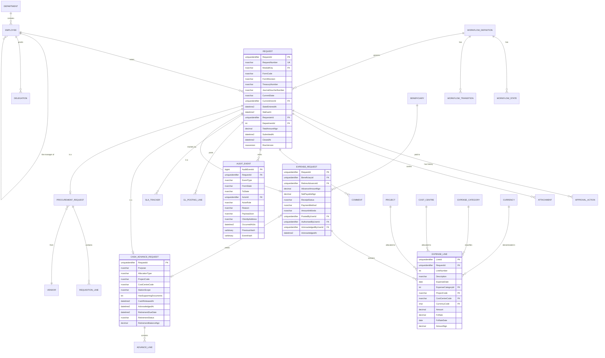

# 03 — Data Model and ERD

The schema splits into three groups: **engine tables** (module-agnostic, never change when a module is added), **module tables** (one set per business process), and **reference tables**.

---

## 1. ERD



---

## 2. Key design decisions

### 2.1 Table-per-type, not a bag of key–value pairs

`REQUEST` holds everything the engine needs; each module gets a strongly-typed child table sharing the same primary key. The tempting alternative — one `REQUEST` table with an `AttributesJson` column — makes adding a module trivially easy and makes every report a nightmare. Table-per-type keeps `SUM(NetPayableNgn) GROUP BY Department` a plain indexed query. Adding a module means one new child table and one JSON definition; the engine is untouched either way.

### 2.2 Money

`decimal(18,2)` for all amounts. Never `float`, never `money`. Every foreign-currency line stores `CurrencyCode`, `Amount`, `FxRate`, `FxRateDate` **and** the derived `AmountNgn` persisted at capture time. The rate is not re-derived on read — a claim approved at ₦1,540/$ must still show ₦1,540/$ in 2031, whatever the rate is then. Rounding is half-away-from-zero, applied once at line level, and the header total is the sum of the rounded lines so the printed form foots exactly.

### 2.3 Optimistic concurrency

`rowversion` on `REQUEST`. Two department heads acting on the same escalated item within the same second is not hypothetical, and the second one must get a clean "this has already been actioned by X" rather than a silent overwrite.

### 2.4 The audit trail is hash-chained and append-only

`AUDIT_EVENT` has no `UPDATE` or `DELETE` grant for the application identity — only `INSERT`. Each row stores `PreviousHash` (the prior event's `EventHash` for the same request) and `EventHash = SHA256(RequestId ‖ EventType ‖ ActorId ‖ OccurredAtUtc ‖ PayloadJson ‖ PreviousHash)`. Tampering with a historical row breaks the chain, and a nightly verification job checks it.

This is more than the brief asks for, and it is what makes the trail worth having. An audit trail that the application can rewrite proves nothing.

`REQUEST` and the module tables additionally use **SQL Server temporal tables** (`SYSTEM_VERSIONING = ON`), giving point-in-time reconstruction of any request without the application doing anything.

### 2.5 Attachments

Blob metadata in `ATTACHMENT`; bytes in Azure Storage under `{moduleKey}/{yyyy}/{requestNumber}/{attachmentId}`. Stored fields: `FileName`, `ContentType`, `SizeBytes`, `Sha256Hash`, `UploadedByUserId`, `UploadedAt`, `ScanStatus`, `IsSupersededBy`.

Rules: uploads are scanned before they become visible to approvers (`ScanStatus` gates it); the container has a time-based immutability policy so an approved receipt cannot be swapped; replacing a document creates a new blob and sets `IsSupersededBy` on the old one rather than overwriting — the original stays retrievable. Access is by short-lived user-delegation SAS, never a public URL, never a permanent SAS in an email.

### 2.6 Amount tampering and line integrity

Lines are immutable once the request leaves `DRAFT`. A `RETURNED` request creates a **new revision** of the line set (`RevisionNumber` on the request) rather than editing rows in place, so an approver reviewing version 3 can see exactly what version 1 said. This is the digital equivalent of the "Amount in Words" control on paper.

### 2.7 Reference data with effective dating

`PROJECT`, `COST_CENTRE`, `EXPENSE_CATEGORY`, and the policy table all carry `EffectiveFrom` / `EffectiveTo`. A cost centre closed in 2027 must still resolve on a 2026 request. The NGN 30,000 payment threshold lives in `POLICY_VALUE` with effective dating for the same reason.

---

## 3. Constraints worth naming explicitly

These come straight from the forms and should exist as database constraints, not only as application validation.

| Constraint | Rule |
|---|---|
| `CK_ExpenseLine_Allocation` | Exactly one of `ProjectCode`, `CostCentreCode` is non-null |
| `CK_Advance_Allocation` | `AllocationType = 'Project'` ⇒ `ProjectCode` non-null; `'CostCentre'` ⇒ `CostCentreCode` non-null |
| `CK_MakerChecker` | `PostedByUserId <> AuthorisedByUserId` |
| `CK_NoSelfApproval` | An `APPROVAL_ACTION` actor may not equal `REQUEST.RequesterId` |
| `CK_GlBalanced` | Enforced in the posting transaction: `SUM(debits) = SUM(credits)` |
| `CK_Currency` | `CurrencyCode = 'NGN'` ⇒ `FxRate = 1.0` |
| `UQ_RequestNumber` | Unique, generated by a database sequence per module per year — no application-side counter, no gaps from failed inserts being reused |
| `CK_RetirementDue` | `RetirementDueDate = AcknowledgedAt + (StationScope = 'InStation' ? 24h : 72h)` |

---

## 4. Indexing for the dashboard

The management dashboards are the reason the platform exists, so index for them deliberately:

```sql
CREATE INDEX IX_Request_Actor_State
  ON Request (CurrentActorId, CurrentState) INCLUDE (RequestNumber, SlaDueAt, TotalAmountNgn);

CREATE INDEX IX_Request_Sla_Breach
  ON Request (SlaDueAt) WHERE ClosedAt IS NULL;

CREATE INDEX IX_Request_Ageing
  ON Request (ModuleKey, CurrentState, SubmittedAt) INCLUDE (TotalAmountNgn, DepartmentId);

CREATE INDEX IX_Advance_Overdue
  ON CashAdvanceRequest (RetirementStatus, RetirementDueDate) INCLUDE (RetirementBalanceNgn);
```

Heavy aggregation (ageing buckets, departmental liability, approver turnaround) runs against the **read replica** of the Business Critical instance via a separate connection string with `ApplicationIntent=ReadOnly`, so a manager running a wide report never slows an approver clicking Approve.
